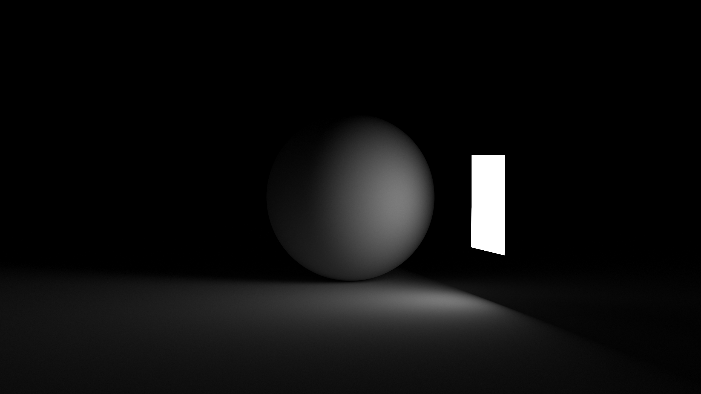

# SPT

This is a simple ray tracing written in Rust based off the ray tracing in a weekend book series.

## Changes

I am using [rayon](https://crates.io/crates/rayon) to parallelize rendering the scene.

I am explicitly handing a random number generator (from [smolprng](https://github.com/DKenefake/smolprng)),
so that the render is entirely deterministic, even with multi threading.
This also helps with multithreading as each thread is not fighting for access for the same prng state.

I am using a different refraction model than the book, I am using instead the approximation proposed by the [photometric blog](https://www.photometric.io/blog/improving-schlicks-approximation/), over the standard [Schlick’s Approximation](https://en.wikipedia.org/wiki/Schlick%27s_approximation) of the fresnel equations.

There is a struct, ``Screen``, that is used to hold all the render data, and is responsible for actually writting the ppm image. This has been taken from the ``Camera`` struct.

The rendering logic has been moved out of the ``Camera`` struct and into a ``Rendering`` trait, so that rendering 
logic is seperated from the ``Camera``.

Instead of passing ``mut`` or ``&mut`` arguments to be the output this has all been replaced with returning sensable outputs. The only place you will see that is for passing the random number generator.

Instead of handrolling the Linear Algebra, I am using [glam](https://crates.io/crates/glam).

Instead of using 32 bit fp numbers e.g ``f32``, I am using 64 bit numbers ``f64``.

Fixed pdf_value to behave correctly w.r.t. time for moving objects.

We are outputting the image as a png instead of ppm, this is done using the [image](https://crates.io/crates/image) crate.
